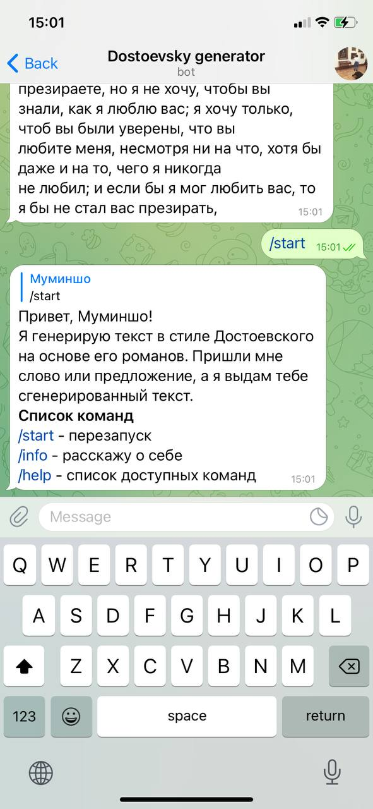
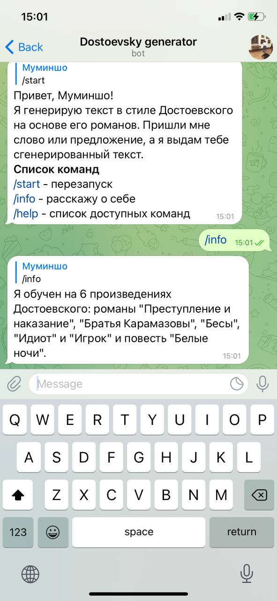
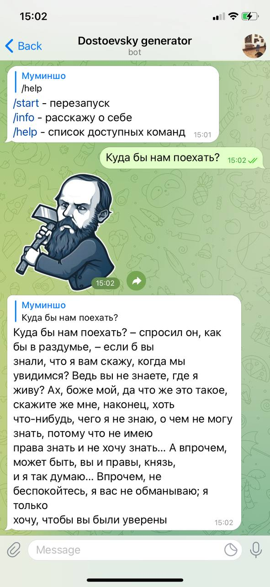

# DostoevskyGen
Generating text a la Dostoevsky

## Description:
- All you need is to write a word or a sentence and neural network will generate new text a la Dostoevsky.

## How it's done:
- Parsed 5 big novels and 1 story all written by the great Fyodor Dostoevsky.
- Preprocessed dataset. 
- Used sberbank-ai/rugpt3large_based_on_gpt2 model and fine tuned it on my dataset.

## How it works:

## Link:
- https://t.me/Dostoevsky_genBot
